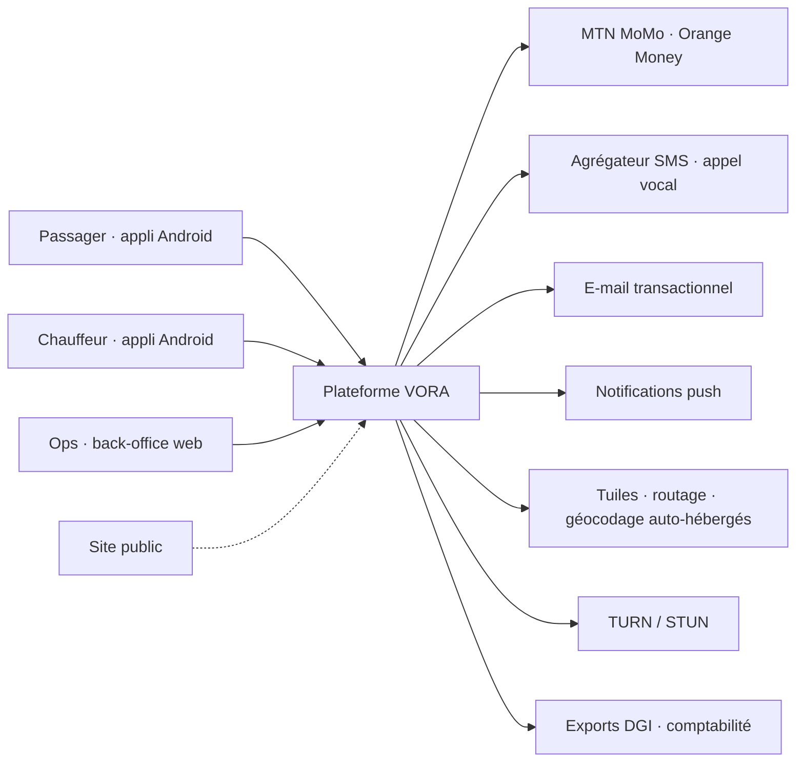
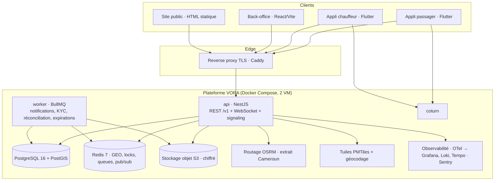
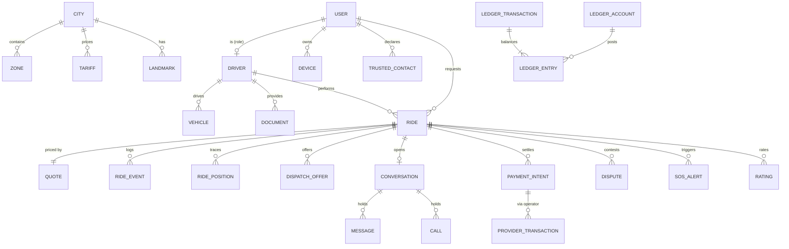
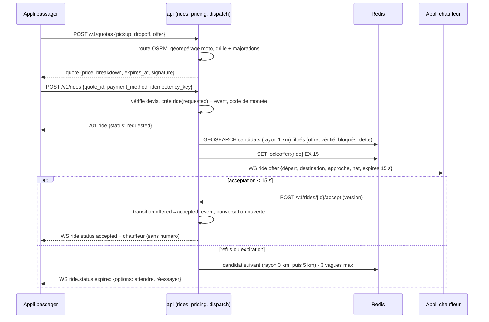
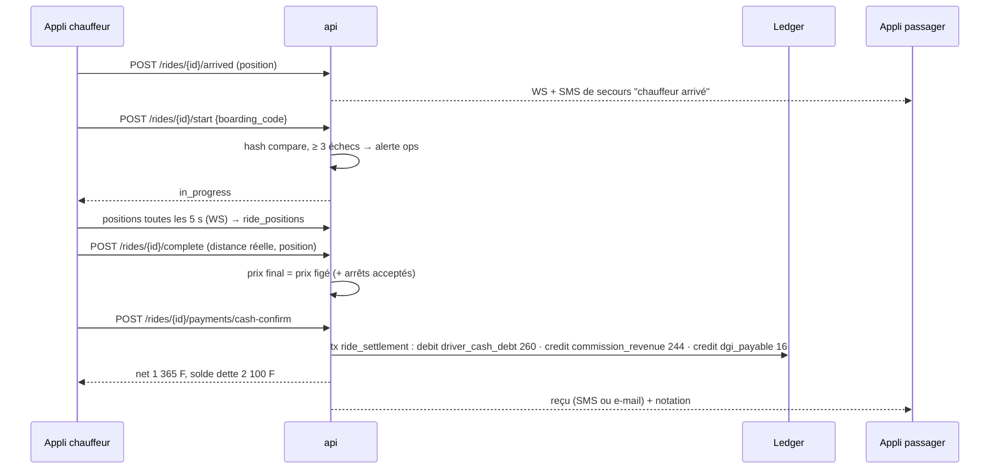
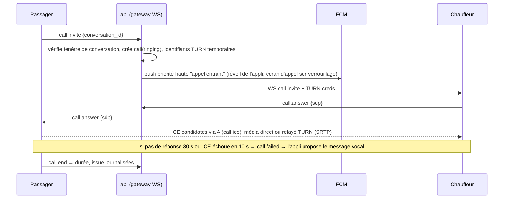
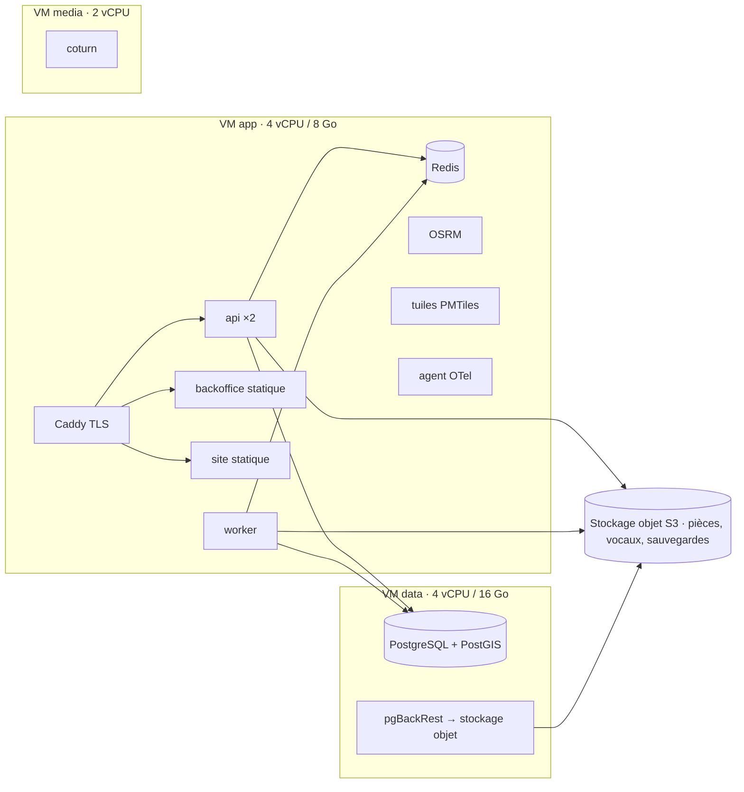

# VORA — Document de conception technique (v1)

| | |
|---|---|
| **Document** | DC-VORA-001 |
| **Version** | 1.0 · 30 août 2026 |
| **Statut** | Proposé · relecture attendue de l'équipe technique et d'un pair externe avant le sprint 1 |
| **Répond à** | CDCT-VORA-001 (toutes les exigences EF / ENF / IF) |
| **Format** | Design doc : contexte, objectifs et non-objectifs, décisions, conception détaillée, alternatives, risques, déploiement, mesure |

---

## 1. Résumé

VORA v1 est un **monolithe modulaire** TypeScript (NestJS) exposant une API REST et une passerelle temps réel, adossé à **PostgreSQL + PostGIS** (vérité des données et géométrie), **Redis** (positions live, dispatch, files, pub/sub) et un stockage objet chiffré (pièces, vocaux). Deux applis **Flutter** (passager, chauffeur) partagent un paquet de composants issu de la charte ; un back-office **React** et un site statique complètent l'ensemble. Cartes, routage et géocodage sont **auto-hébergés** sur un extrait Cameroun pour maîtriser le coût et ne dépendre d'aucune clé tierce. Les appels VORA reposent sur **WebRTC** avec un serveur TURN dédié. Tout l'argent passe par un **ledger en double entrée**, toute course par une **machine à états** journalisée.

Le système est dimensionné pour 10 × la cible de l'an 1 sans changer d'architecture, et conçu pour extraire plus tard le dispatch et la messagerie en services séparés si le volume l'exige (§ 17).

## 2. Objectifs et non-objectifs

**Objectifs**
1. Tenir les trois moments de vérité du produit dans du code : prix figé à la commande, attribution rapide et juste, net exact et immuable pour le chauffeur.
2. Fonctionner avec un réseau faible : idempotence de bout en bout, files locales, repli SMS.
3. Rendre la conformité mécanique : géorepérage moto côté serveur, pièces bloquantes, retenue DGI par course, données minimisées.
4. Rester exploitable par deux personnes : peu de composants, automatisation, observabilité dès le premier jour.

**Non-objectifs (v1)**
- Microservices, Kubernetes, multi-région.
- Tarification apprise, prédiction de demande (préparées par le journal d'événements, pas implémentées).
- Relais téléphonique opérateur, comptes entreprises, iOS.

## 3. Vue d'ensemble

### 3.1 Contexte (C4 niveau 1)



### 3.2 Conteneurs (C4 niveau 2)



### 3.3 Modules du monolithe (bounded contexts)

| Module | Responsabilité | Données possédées | Dépend de |
|---|---|---|---|
| **identity** | Comptes, OTP, ID VORA, jetons, appareils, contacts de confiance, consentements | users, auth_otps, devices, trusted_contacts, consents | notifications |
| **geo** | Repères, géocodage, routage, zones (publication, géorepérage), ETA | landmarks, zones, cities | OSRM, PMTiles |
| **pricing** | Grilles versionnées, majorations, devis figés, calcul du net | tariffs, surge_rules, quotes | geo |
| **rides** | Machine à états, événements, code de montée, traces, annulations, arrêts | rides, ride_events, ride_positions, ride_stops | pricing, dispatch, payments, messaging |
| **dispatch** | Candidats, score, offres séquentielles, vagues, réattribution, bonus de zone | dispatch_offers, driver_live (Redis) | geo, rides |
| **drivers** | Statut chauffeur, véhicule, offres, mise en ligne, notes, blocages | drivers, vehicles, ratings, blocks | compliance |
| **compliance** | Pièces, revue, expirations, suspension, charte | documents, document_reviews, charter_acceptances | notifications |
| **payments** | Encaissement espèces / MoMo / OM, recharges, retraits, réconciliation, retenue DGI | payment_intents, provider_transactions | ledger |
| **ledger** | Comptes et écritures en double entrée, soldes, plafonds | ledger_accounts, ledger_transactions, ledger_entries | — |
| **messaging** | Conversations liées aux courses, messages, vocaux, signalisation d'appel | conversations, messages, calls | notifications |
| **safety** | SOS, partage de trajet, alertes ops | sos_alerts, trip_shares | notifications, messaging |
| **disputes** | Litiges, chronologie, décisions, sanctions | disputes, sanctions | rides, ledger |
| **notifications** | Push, SMS, appel vocal, e-mail, gabarits FR/EN, préférences | notifications, templates | fournisseurs |
| **ops** | Utilisateurs ops, rôles, audit, tableau de bord, exports, drapeaux | ops_users, audit_log, feature_flags | tous (lecture) |

Règle d'architecture : un module n'écrit que dans ses tables ; il expose un service applicatif et publie des **événements de domaine** internes (`RideAccepted`, `PaymentConfirmed`, `DocumentExpired`…) consommés par les autres modules via un bus en mémoire (NestJS EventEmitter) en v1, remplaçable par un bus externe (§ 17).

## 4. Décisions d'architecture (ADR condensés)

Chaque ADR complet est dans `docs/adr/`. Résumé des décisions structurantes, avec les options écartées.

| ADR | Décision | Options écartées | Pourquoi |
|---|---|---|---|
| **001 Monolithe modulaire NestJS** (accepté) | Une application TypeScript, modules à frontières strictes, déploiement en deux processus (api, worker) | Microservices Node ; Go monolithe ; Django | Équipe de 2–3 ; un seul déploiement à exploiter ; frontières de modules préparent l'extraction ; NestJS impose une structure (modules, injection, guards, gateways WS) |
| **002 PostgreSQL + PostGIS** (accepté) | Une base pour la vérité des données et la géométrie (zones, repères, traces) | MongoDB ; Postgres sans PostGIS + géo en application | Transactions pour le ledger ; `ST_Intersects` pour le géorepérage ; partitionnement des traces ; un seul moteur à sauvegarder |
| **003 Redis pour le temps réel et le dispatch** (accepté) | Positions live en structures GEO, verrous d'offre, files BullMQ, pub/sub pour la passerelle WS | Tout en Postgres ; Kafka dès v1 | 400 positions/s à 10 × ne justifient pas Kafka ; Redis couvre GEO, TTL, verrous et files avec un seul composant |
| **004 Socket.IO avec adaptateur Redis** (accepté) | Une passerelle temps réel par processus api, salles par course et par chauffeur | WebSocket brut ; MQTT ; polling | Reconnexion, salles et repli intégrés ; adaptateur Redis pour plusieurs instances ; même canal pour la signalisation WebRTC |
| **005 Cartes auto-hébergées** (accepté) | Tuiles vectorielles PMTiles (extrait Cameroun) servies depuis le stockage objet, style charte ; OSRM pour le routage ; géocodage local en repli de la base de repères | Google Maps Platform ; Mapbox | Zéro clé côté client, coût fixe et faible, latence locale ; la base de repères est de toute façon propriétaire ; qualité OSM suffisante sur Yaoundé, améliorable par contributions |
| **006 Flutter en monorepo, deux applis, un paquet UI** (accepté) | `apps/passager`, `apps/chauffeur`, `packages/vora_ui` (jetons de la charte), `packages/vora_core` (modèles, client API, i18n), Riverpod | Une seule appli avec bascule de rôle ; React Native | Deux publics, deux magasins de listes, un seul code de composants ; Riverpod pour la testabilité (Provider acceptable si déjà maîtrisé) |
| **007 WebRTC + coturn pour les appels** (accepté) | Signalisation via Socket.IO, ICE avec STUN/TURN dédié, Opus bas débit, repli vocal | Fournisseur CPaaS (Twilio, Agora) ; relais opérateur | Coût par minute nul, aucun numéro échangé ; le repli vocal absorbe les échecs ; relais opérateur en v2 si le terrain l'exige |
| **008 Ledger en double entrée** (accepté) | Toute somme est une écriture immuable dans une transaction équilibrée ; les soldes sont des vues matérialisées | Champ `balance` mis à jour ; table de mouvements simple | Litiges, exports DGI, réconciliation opérateurs : il faut pouvoir prouver chaque franc ; invariant débit = crédit testable |
| **009 Machine à états + journal d'événements** (accepté) | Transitions explicites côté serveur, table `ride_events` append-only, projection `rides` | Statut libre mis à jour par les clients | Trois surfaces doivent afficher le même statut ; les litiges se jugent sur la chronologie ; base pour l'analytique et l'IA v2 |
| **010 Hébergement UE + autorisation APDP** (proposé) | Deux VM chez un hébergeur européen, données chiffrées, demande d'autorisation de transfert déposée avant le pilote ; migration locale possible | Hébergement local dès v1 ; cloud US | Offre locale à qualifier (sauvegardes, support) ; la loi 2024/017 autorise le transfert sur autorisation ; latence Yaoundé → Europe ≈ 120 ms, acceptable |
| **011 Drizzle ORM + SQL explicite** (accepté) | Schéma typé, migrations versionnées, SQL brut pour PostGIS et le ledger | Prisma ; TypeORM | PostGIS et requêtes de fenêtre mal servis par Prisma ; Drizzle reste proche du SQL et léger |
| **012 Drapeaux de fonctionnalités et déploiement progressif** (accepté) | Drapeaux côté serveur (par ville, par pourcentage, par liste), version minimale mobile imposée | Branches longues ; déploiement tout ou rien | Pilote fermé, Orange Money activable sans redéploiement, appels VORA désactivables si le terrain les met en défaut |

Décisions « porte à sens unique » (coûteuses à inverser) : 002, 006, 008, 010. Elles ont été relues en priorité. Les autres sont réversibles à coût modéré.

## 5. Modèle de données

### 5.1 Entités principales



### 5.2 Tables clés (extraits)

```sql
-- Identité : PII chiffrée par colonne (pgcrypto, clé hors base), index sur un hachage pour l'unicité
create table users (
  id uuid primary key default gen_random_uuid(),
  vora_id char(8) not null unique,               -- 8 chiffres, généré (Luhn interne + rejet des motifs triviaux)
  role text not null check (role in ('passenger','driver','ops')),
  display_name text not null,
  photo_key text,
  locale text not null default 'fr',
  phone_enc bytea, phone_hash bytea unique, phone_verified_at timestamptz,
  email_enc bytea, email_hash bytea unique, email_verified_at timestamptz,
  status text not null default 'active',          -- active | suspended | deleted
  created_at timestamptz not null default now(),
  check (phone_verified_at is not null or email_verified_at is not null or status = 'deleted')
);

-- Course : projection de la machine à états ; la vérité est ride_events
create table rides (
  id uuid primary key, city_id smallint not null references cities,
  passenger_id uuid not null references users, driver_id uuid references users, vehicle_id uuid,
  offer text not null check (offer in ('eco','confort','moto')),
  status text not null,                            -- draft|requested|offered|accepted|approaching|arrived|in_progress|completed|paid|rated|expired|cancelled_free|cancelled_late|cancelled_driver|no_show
  quote_id uuid not null references quotes,
  pickup geography(point,4326) not null, pickup_label text, pickup_note text, pickup_photo_key text,
  dropoff geography(point,4326) not null, dropoff_label text,
  route geography(linestring,4326),               -- itinéraire calculé à la commande
  price_quoted int not null, price_final int, distance_m int, duration_s int,
  payment_method text not null default 'cash',
  boarding_code_hash bytea not null,
  requested_at timestamptz, accepted_at timestamptz, arrived_at timestamptz, started_at timestamptz, completed_at timestamptz, paid_at timestamptz,
  version int not null default 0                   -- verrou optimiste
);
create index rides_status_idx on rides (status) where status not in ('paid','rated','expired');
create index rides_passenger_idx on rides (passenger_id, requested_at desc);

create table ride_events (                        -- append-only, jamais mis à jour
  id bigserial primary key, ride_id uuid not null references rides,
  type text not null, actor_type text not null, actor_id uuid,
  payload jsonb not null default '{}', occurred_at timestamptz not null default now()
);

create table ride_positions (                     -- partitionnée par jour, purgée à 90 jours
  ride_id uuid not null, actor text not null check (actor in ('passenger','driver')),
  ts timestamptz not null, geom geography(point,4326) not null, speed_kmh real, accuracy_m real
) partition by range (ts);

-- Ledger : la somme des montants d'une transaction vaut 0 (contrainte vérifiée par trigger différé)
create table ledger_transactions (
  id uuid primary key, kind text not null,          -- ride_settlement|cancel_fee|recharge|withdrawal|dgi_transfer|adjustment
  ride_id uuid, external_ref text, status text not null default 'posted', created_at timestamptz not null default now()
);
create table ledger_entries (
  id bigserial primary key, tx_id uuid not null references ledger_transactions,
  account_id uuid not null references ledger_accounts, amount int not null,  -- en francs, signé
  memo text, created_at timestamptz not null default now()
);
-- Zones : polygones publiés par version ; le géorepérage n'utilise que la version publiée
create table zones (
  id uuid primary key, city_id smallint not null, kind text not null,       -- moto_allowed|moto_forbidden|car_corridor|bonus
  name text not null, geom geography(polygon,4326) not null, published_version int, active boolean not null default false,
  bonus_amount int, schedule jsonb
);
create index zones_geom_idx on zones using gist (geom);
```

Comptes du ledger par chauffeur : `driver_cash_debt` (commission et retenue dues sur les courses en espèces), `driver_inapp_balance` (encaissements MoMo disponibles au retrait), et comptes VORA : `commission_revenue`, `dgi_payable`, `compensation_pool`, `operator_clearing` (par opérateur). Le « solde à régler » affiché au chauffeur est le solde de `driver_cash_debt` ; le plafond est une règle applicative lue à la mise en ligne et à chaque encaissement espèces.

Autres tables : `quotes` (points, offre, version tarifaire, décomposition, expiration, empreinte HMAC), `dispatch_offers` (course, chauffeur, vague, expiration, réponse), `documents` / `document_reviews`, `conversations` / `messages` / `calls`, `payment_intents` / `provider_transactions` (référence externe unique, statut, charge utile de retour), `sos_alerts`, `trip_shares` (jeton public, expiration), `disputes` / `sanctions`, `ratings`, `blocks`, `notifications`, `ops_users`, `audit_log`, `feature_flags`, `landmarks` (nom, alias, catégorie, géométrie, source, score de confiance), `tariffs` / `surge_rules`.

### 5.3 Index et volumes

Positions : 600 courses/jour × ~200 points × 2 acteurs ≈ 240 000 lignes/jour, 22 millions sur 90 jours (partitions journalières, purge par suppression de partition). Événements : ~20 par course, 12 000/jour. Le reste est négligeable. À 10 ×, la base tient sur une VM de 8 vCPU / 32 Go avec des partitions et un index GiST sur les zones ; les positions hors course restent dans Redis (TTL 60 s) et ne touchent jamais Postgres.

## 6. Flux clés

### 6.1 Commande → devis → attribution



### 6.2 Code de montée, course, paiement espèces



Paiement MoMo : `POST /rides/{id}/payments/momo` crée un `payment_intent`, appelle l'API de collecte (request-to-pay) avec une référence unique, puis attend le retour opérateur (rappel HTTP signé, complété par une interrogation périodique du worker). Au succès : `ledger` crédite `driver_inapp_balance` du net et `commission_revenue` / `dgi_payable`, `operator_clearing` porte le brut. Échec ou délai > 90 s : l'appli propose le repli espèces ; l'intention est marquée `failed` et jamais rejouée sans nouvelle action du passager.

### 6.3 Annulation tardive et compensation

Le passager annule après la fenêtre gratuite → transition `cancelled_late` → `ledger` crédite `driver_inapp_balance` de 300 F depuis `compensation_pool` (VORA avance) et crée une **créance passager** (`passenger_receivable`) soldée sur sa prochaine course (ajoutée au devis suivant, ligne visible). Le chauffeur voit la compensation immédiatement (§ maquettes CH-11).

### 6.4 Appel VORA (signalisation)



### 6.5 Dossier chauffeur

Téléversement direct vers le stockage objet par URL signée (l'api ne relaie pas les fichiers) → contrôle de netteté déjà fait sur l'appareil (variance du laplacien, seuil calibré) → `documents(pending)` → file de revue ops → décision par pièce → événement `DocumentReviewed` → quand les 7 sont `valid`, `drivers.status = verified`. Le worker exécute chaque nuit les rappels J-30 / J-7 / J et passe `expired` + `drivers.status = suspended` le jour J ; la validation d'une nouvelle pièce remet `verified` sans intervention.

## 7. Algorithmes

### 7.1 Dispatch

1. **Candidats** : `GEOSEARCH drivers:{city}:{offer} FROMLONLAT … BYRADIUS r` sur Redis (positions TTL 60 s), r ∈ {1, 3, 5} km. Filtres : `verified`, `online`, dette < plafond, pas dans `blocks`, pas d'offre en cours, moto : véhicule moto.
2. **Géorepérage moto** (avant même de chercher) : `ST_Intersects(route, zones moto_forbidden publiées)` sur départ, arrivée et itinéraire ; refus immédiat `MOTO_ZONE_FORBIDDEN`.
3. **Score** : `s = 0.55·eta_norm + 0.20·acceptance_rate + 0.15·(1 − cancel_rate) + 0.10·rating_norm`, avec `eta` = durée d'approche OSRM (repli : distance à vol d'oiseau / 20 km/h). Bonus de zone : les chauffeurs déjà dans une zone à bonus ne sont pas favorisés (le bonus sert à attirer, pas à trier) ; en revanche une demande située dans une zone à bonus est proposée aussi aux chauffeurs jusqu'à 7 km.
4. **Offre séquentielle** : verrou Redis `lock:ride:{id}` (15 s), offre à un seul chauffeur, expiration par clé TTL et minuteur de secours côté worker ; refus ou expiration → suivant ; 3 vagues → `expired`, le passager peut relancer (nouvelle recherche, même devis si < 2 min).
5. **Réattribution** : le worker surveille `accepted` et `approaching` ; si la distance au point de rendez-vous n'a pas diminué de 100 m en 3 min → réattribution et pénalité de priorité (30 min) pour le chauffeur.
6. **Équité** : les taux d'acceptation et d'annulation sont calculés sur les 50 dernières offres avec lissage bayésien pour ne pas punir les nouveaux.

### 7.2 Tarification

Fonction pure `price(quoteInput, tariffVersion, surgeContext) → breakdown`, sans accès réseau, testée par table de vérité. Arrondi au franc à chaque ligne, puis total. Le devis porte une empreinte HMAC des entrées ; la commande vérifie l'empreinte et l'expiration. Les majorations sont évaluées à l'heure de la **commande**, pas de la fin de course. L'arrêt ajouté crée un nouveau devis lié (`quotes.parent_id`) accepté par les deux parties avant application.

### 7.3 ETA et positions

Positions chauffeur reçues en WS, écrites en Redis (`GEOADD` + hash `driver:{id}` avec cap, vitesse, ts), publiées aux salles de course concernées, persistées en Postgres uniquement pendant une course. ETA = OSRM sur l'itinéraire d'approche, recalculé toutes les 30 s ou à chaque déviation > 150 m ; lissé pour ne pas osciller.

### 7.4 Détection d'anomalies (v1 simple, v2 apprise)

Règles serveur : détour > 40 % de l'itinéraire calculé → événement `RouteDeviation` visible dans le litige ; course terminée à > 500 m de la destination → `EarlyCompletion` ; codes faux ≥ 3 → alerte ; signalement « supplément » → litige automatique avec les preuves attachées. Ces événements alimentent les décisions pré-remplies du back-office (OP-07).

## 8. API

### 8.1 Conventions

REST JSON sous `/v1`, OpenAPI 3.1 générée depuis le code (décorateurs NestJS + zod), erreurs au format `application/problem+json` (`type`, `title`, `status`, `code`, `detail`, `trace_id`). **Idempotency-Key** obligatoire sur toute création (courses, paiements, messages) ; les réponses sont mémorisées 24 h par clé. Pagination par curseur. Versionnage par préfixe ; les clients envoient `X-App-Version` et le serveur répond `426` avec une version minimale quand une mise à jour est forcée. Toutes les réponses excluent les PII d'autrui (DTO de sortie explicites, jamais d'entité brute).

### 8.2 Points d'entrée principaux

| Domaine | Endpoints |
|---|---|
| Identité | `POST /auth/otp/request` · `POST /auth/otp/verify` · `POST /auth/refresh` · `POST /auth/logout` · `GET/PATCH /me` · `POST /me/channels` · `PUT /me/trusted-contacts` · `DELETE /me` |
| Géo | `GET /geo/search?q=` · `GET /geo/reverse?lat&lng` · `GET /geo/zones?city=` (publiées) · `POST /geo/landmarks/suggest` |
| Prix et courses | `POST /quotes` · `POST /rides` · `GET /rides/{id}` · `POST /rides/{id}/cancel` · `POST /rides/{id}/stops` · `GET /rides?cursor` · `POST /rides/{id}/rating` · `POST /rides/{id}/report` |
| Chauffeur | `POST /driver/online` · `POST /driver/offline` · `POST /driver/offers/{id}/accept|decline` · `POST /rides/{id}/arrived|start|complete|no-show` · `GET /driver/earnings?period` · `GET /driver/balance` · `POST /driver/recharge` · `POST /driver/withdraw` · `GET/POST /driver/documents` |
| Paiements | `POST /rides/{id}/payments/cash-confirm` · `POST /rides/{id}/payments/mobile-money` · `POST /webhooks/momo` · `POST /webhooks/orange` |
| Messagerie | `GET /conversations/{id}/messages` · `POST /conversations/{id}/messages` (texte, prédéfini, vocal via URL signée) |
| Sécurité | `POST /rides/{id}/sos` · `POST /rides/{id}/share` · `GET /share/{token}` (public) |
| Ops | `/ops/dashboard` · `/ops/documents` · `/ops/drivers/{id}` · `/ops/disputes` · `/ops/zones` (+ `/publish`) · `/ops/tariffs` (+ `/simulate`, `/publish`) · `/ops/exports` · `/ops/audit` |

### 8.3 Événements temps réel (Socket.IO)

| Direction | Événement | Charge utile |
|---|---|---|
| chauffeur → serveur | `driver.position` | lat, lng, heading, speed, accuracy, ts (toutes les 5 s) |
| serveur → chauffeur | `ride.offer` | course résumée, net, expires_at |
| serveur → passager | `ride.status`, `ride.driver_position`, `ride.eta` | statut, position, ETA |
| bidirectionnel | `message.new`, `message.read` | message sans PII |
| bidirectionnel | `call.invite`, `call.answer`, `call.ice`, `call.end`, `call.failed` | SDP, candidats ICE, identifiants TURN |
| serveur → ops | `ops.sos`, `ops.metrics` | alerte, compteurs |

Reconnexion : le client renvoie `last_event_id` ; le serveur rejoue les événements manqués de la course (tampon Redis 10 min). Les commandes restent REST : une action manquée en WS est toujours rattrapable par `GET /rides/{id}`.

## 9. Mobile, temps réel et hors ligne

- **File locale** : commandes, messages et positions sont écrits dans une base locale (SQLite via drift) avec leur clé d'idempotence, envoyés par un exécuteur avec reprise exponentielle ; l'interface reflète l'état « en attente d'envoi ».
- **Cache carte** : tuiles PMTiles de la zone de service mises en cache à la première ouverture (~40 Mo pour Yaoundé, téléchargement en Wi-Fi si possible) ; l'itinéraire en cours est stocké localement pour la navigation sans réseau.
- **Positions** : fréquence 5 s en mouvement, 15 s à l'arrêt (détection par vitesse < 2 km/h pendant 30 s), service en avant-plan Android avec notification persistante côté chauffeur ; en course, le passager envoie aussi sa position (utile au litige).
- **Réveil** : demandes de course et appels par FCM priorité haute + service en avant-plan ; écran d'appel sur verrouillage par `ConnectionService` (`flutter_callkit_incoming`).
- **Repli SMS** : déclenché côté serveur quand un événement critique (`accepted`, `arrived`) n'est pas acquitté par le client passager en 20 s et que le compte a un téléphone vérifié.
- **Tailles** : APK scindé par ABI, polices embarquées en sous-ensemble, images vectorielles ; pas de flou ni d'ombre lourde (charte).

## 10. Sécurité et confidentialité

### 10.1 Menaces principales (STRIDE, extrait)

| Menace | Contrôle |
|---|---|
| Usurpation de compte par OTP (SIM swap, force brute) | Limites de tentatives et d'envois, blocage progressif, alerte de nouvel appareil, appareil unique chauffeur, jetons courts et refresh rotatif avec détection de réutilisation |
| Fuite de PII (numéro, e-mail, pièces) | Chiffrement par colonne (clé dans le gestionnaire de secrets), DTO de sortie explicites, URL signées, journalisation des accès, jamais de PII dans les journaux applicatifs |
| Manipulation de prix ou de statut par un client | Devis signé HMAC, machine à états côté serveur, verrou optimiste, position vérifiée pour `arrived` / `no-show` |
| Faux comptes chauffeurs, pièces falsifiées | Revue humaine, contrôles de cohérence, unicité des plaques et des CNI (hachées), sanctions |
| Abus de la messagerie (harcèlement) | Conversation liée à la course et fermée après 30 min, signalement, blocage, lecture ops sur litige seulement |
| Interception des appels | DTLS-SRTP obligatoire, identifiants TURN temporaires (TTL 1 h) signés par le serveur |
| Attaques sur les rappels de paiement | Signature ou secret partagé vérifié, référence unique, idempotence, réconciliation quotidienne |
| Compromission du back-office | 2FA, rôles minimaux, journal d'audit immuable, sessions courtes, IP allow-list optionnelle |
| Épuisement de ressources (spam de devis, positions) | Limitation de débit par compte et par IP, taille des charges utiles, TTL Redis |

### 10.2 Confidentialité (loi 2024/017)

Registre des traitements tenu dans `docs/privacy/registre.md` ; consentement horodaté à l'inscription (`consents`) ; minimisation (positions hors course non persistées) ; conservation automatisée (jobs de purge) ; droits d'accès et de suppression exposés au support (export JSON, anonymisation) ; hébergement documenté et autorisation de transfert demandée (ADR-010). Les analyses produit utilisent des identifiants pseudonymes.

## 11. Fiabilité et exploitation

### 11.1 SLO et budget d'erreur

| SLI | SLO | Mesure |
|---|---|---|
| Disponibilité création de course + attribution (6 h – 24 h) | 99,5 % mensuel | Succès `/rides` et première offre < 10 s |
| Latence devis | p95 < 1,5 s | Serveur |
| Fraîcheur position chauffeur | p95 < 5 s | Horodatage client vs réception |
| Livraison des demandes de course | 99 % en < 3 s | Envoi WS ou push → acquittement |
| Paiements MoMo | 97 % confirmés en < 90 s | Intents |

Le budget d'erreur (≈ 2,7 h / mois) gèle les déploiements risqués lorsqu'il est consommé à 80 %.

### 11.2 Modèle de charge et dimensionnement

| Cible an 1 | Pic | À 10 × |
|---|---|---|
| 300 – 600 courses / jour | 80 courses / h, 1,3 / min | 800 / h |
| 200 chauffeurs en ligne | 40 positions / s | 400 positions / s |
| API | < 20 req / s | < 200 req / s |
| WS connexions simultanées | ~500 | ~5 000 |

Un processus Node tient sans peine 200 req/s et 5 000 connexions WS ; deux instances `api` derrière le proxy (adaptateur Redis) donnent la redondance. Postgres : 4 vCPU / 16 Go suffisent à 10 ×. Le goulot réel sera OSRM sous les rafales de devis : deux instances et un cache des itinéraires fréquents (clé = points arrondis à 50 m).

### 11.3 Infrastructure



Provisionnement par Ansible (idempotent), conteneurs orchestrés par Docker Compose, secrets chiffrés (SOPS + age) dans le dépôt, rotation trimestrielle. Sauvegardes : pgBackRest (complète quotidienne, WAL continu, rétention 30 jours, copie hors fournisseur), restauration testée chaque mois par script. Reprise : recréation des VM par Ansible en < 2 h (RTO), RPO ≤ 15 min.

### 11.4 Observabilité et alertes

OpenTelemetry (traces + métriques) → Grafana / Tempo / Prometheus ; journaux structurés JSON → Loki ; erreurs et plantages mobiles → Sentry ; disponibilité externe → sonde HTTP toutes les minutes. Tableaux de bord : SLO, files BullMQ, dispatch (offres, délais, vagues), paiements (intents par statut), WS (connexions, reconnexions), OSRM (latence). Alertes (Telegram / SMS de l'astreinte) : SLO en danger, file bloquée > 5 min, taux d'échec paiement > 5 %, aucune position reçue depuis 60 s alors que des chauffeurs sont en ligne, espace disque, certificat.

Runbooks obligatoires avant le pilote : incident majeur, restauration de base, opérateur MoMo indisponible (bascule espèces), SMS indisponible (bascule fournisseur, e-mail), TURN saturé (désactivation des appels par drapeau), rotation des secrets, déploiement et retour arrière.

## 12. Déploiement et livraison

- **Environnements** : dev (Compose local, bacs à sable), staging (identique à prod, données synthétiques), prod.
- **Pipeline** (GitHub Actions) : lint → tests unitaires → tests d'intégration (Testcontainers : Postgres + Redis) → build images → scan (Trivy, npm audit) → génération OpenAPI et vérification de compatibilité → déploiement staging automatique → tests e2e API → déploiement prod sur étiquette `vX.Y.Z` (migration Drizzle, redémarrage progressif des deux instances).
- **Mobile** : Fastlane → piste interne à chaque fusion sur `main`, piste fermée (pilote) à chaque étiquette, piste ouverte après LRR ; version minimale côté serveur ; symboles envoyés à Sentry.
- **Migrations** : additives d'abord, suppression deux versions plus tard ; jamais de migration destructive sans sauvegarde immédiate.
- **Drapeaux** : `orange_money`, `vora_calls`, `voice_notes`, `moto_offer`, `rain_surge`, `city_douala` ; évaluation côté serveur et côté client (valeurs poussées à la connexion).

## 13. Tests

| Niveau | Cible | Outils |
|---|---|---|
| Unitaires | pricing (table de vérité), machine à états (transitions exhaustives), scoring dispatch, ledger (invariant), géorepérage (50 trajets de référence), générateur d'ID | Vitest |
| Intégration | API + Postgres + Redis réels, webhooks opérateurs simulés, idempotence, purge | Testcontainers, supertest |
| Contrat | OpenAPI ↔ clients Flutter/React générés ; rupture détectée en CI | openapi-diff |
| E2E mobile | boucle passager et boucle chauffeur sur émulateur, dont hors ligne (réseau coupé 2 min) et code faux | Patrol / integration_test |
| Charge | 600 → 6 000 courses/jour simulées, 400 positions/s, 500 WS ; devis sous rafale | k6, script de chauffeurs virtuels |
| Chaos | Redis redémarré pendant une offre, Postgres en lecture seule 30 s, OSRM indisponible | scripts Compose |
| Sécurité | dépendances, secrets, en-têtes, tests d'autorisation croisée (un passager lit une autre course) | Trivy, gitleaks, tests dédiés |
| Terrain | 30 voitures + 15 motos, 4 semaines, indicateurs du brief | pilote fermé |

Objectif de couverture : ≥ 80 % sur pricing, dispatch, ledger, rides ; le reste sans seuil imposé mais avec e2e.

## 14. Coûts d'infrastructure (estimation mensuelle)

| Poste | Estimation | Note |
|---|---|---|
| 3 VM (app, data, media) | 60 – 90 € | hébergeur européen ; local à requalifier |
| Stockage objet (pièces, vocaux, sauvegardes, tuiles) | 5 – 15 € | |
| SMS | variable, ≈ 15 – 25 F / SMS | 10 000 SMS/mois ≈ 150 000 – 250 000 F ; l'e-mail et le push limitent le volume |
| E-mail transactionnel | 0 – 20 € | |
| Observabilité, erreurs | 0 – 30 € | niveaux gratuits au départ |
| Domaine, certificats | ~2 € | TLS gratuit |
| Google Play | 25 $ une fois | |
| Frais opérateurs MoMo / OM | par transaction | à négocier avec les opérateurs |

Total fixe < 200 € / mois jusqu'à 1 000 courses/jour (ENF-COST-01) ; le variable est dominé par les SMS.

## 15. Risques techniques

| Risque | Probabilité | Impact | Mitigation |
|---|---|---|---|
| Accès production aux API MoMo / Orange Money retardé | Élevée | Élevé | Démarrer les démarches au sprint 0 ; espèces + recharge par transfert manuel documentée comme repli ; drapeau par opérateur |
| Appels VORA peu fiables sur réseau faible | Élevée | Moyen | Repli vocal et messages ; mesure du taux d'établissement ; drapeau de désactivation ; relais opérateur en v2 |
| Réveil de l'appli chauffeur bloqué par les surcouches Android (économie d'énergie) | Élevée | Élevé | Service en avant-plan, guide d'exemption batterie par marque dans l'onboarding, test sur les 5 modèles les plus vendus à Yaoundé |
| Qualité OSM insuffisante dans certains quartiers | Moyenne | Moyen | Base de repères, correction manuelle, contributions OSM planifiées, repli distance à vol d'oiseau majorée |
| Livraison SMS lente ou fournisseur en panne | Moyenne | Moyen | Deux fournisseurs, bascule automatique, appel vocal, e-mail |
| Refus ou délai de l'autorisation APDP | Moyenne | Élevé | Dossier déposé avant le pilote ; plan B d'hébergement local qualifié |
| Fraude interne (ops) | Faible | Élevé | 2FA, rôles, audit immuable, double validation sur tarifs et remboursements > 5 000 F |
| Dette technique sous pression de calendrier | Élevée | Moyen | Couverture imposée sur les 4 modules critiques, revue obligatoire, 15 % de chaque sprint réservés |

## 16. Alternatives considérées (résumé)

Microservices dès v1 (complexité d'exploitation disproportionnée pour 2 personnes) · Firebase / BaaS (verrouillage, coût variable, géorepérage et ledger inadaptés) · Google Maps Platform (coût par requête, clé exposée, dépendance) · CPaaS pour les appels (coût par minute, mais reste l'option v2 la plus simple si WebRTC échoue sur le terrain) · Kafka (aucun besoin avant 100 × la charge) · Application unique à double rôle (parcours et magasins différents, risque de confusion).

## 17. Ce qu'on revisitera à 10 ×

1. **Dispatch** : extraction en service dédié avec son propre Redis si les offres dépassent 10 / s ou si la logique de prédiction arrive.
2. **Messagerie et appels** : service séparé (charge WS différente, montée en charge indépendante).
3. **Bus d'événements** : passage de l'émetteur en mémoire à NATS ou Kafka quand un consommateur externe (analytique temps réel, second service) apparaît ; le journal `ride_events` rend la migration indolore.
4. **Base** : réplica en lecture pour le back-office et l'analytique ; partition par ville si Douala dépasse Yaoundé.
5. **Orchestration** : Kubernetes ou Nomad seulement à partir de 5 instances `api` et d'une équipe capable de l'exploiter.
6. **Cartes** : contribution OSM structurée, puis moteur de géocodage propre entraîné sur les repères.
