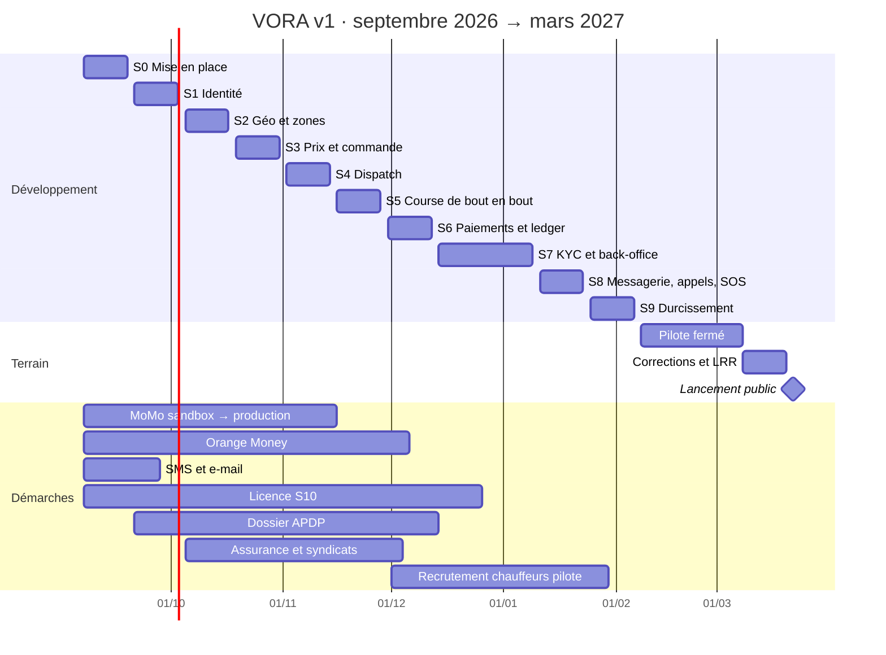

# VORA — Planification et plan de développement (v1)

| | |
|---|---|
| **Document** | PL-VORA-001 |
| **Version** | 1.0 · 30 août 2026 |
| **Statut** | Proposé · à valider avec l'équipe avant le 7 septembre 2026 |
| **Répond à** | CDCT-VORA-001 (exigences), DC-VORA-001 (conception) |
| **Horizon** | Sprint 0 le 7 septembre 2026 → lancement public à Yaoundé la semaine du 22 mars 2027 |

---

## 1. Hypothèses

- **Équipe** : 2,5 équivalents temps plein de développement (voir § 2), un profil ops / produit à mi-temps jusqu'au pilote puis à plein temps, un designer ponctuel, un conseil juridique et fiscal ponctuel.
- **Capacité** : sprints de 2 semaines, 25 jours-personne de développement par sprint, dont 15 % réservés aux imprévus, à la dette et à la revue (capacité nette ≈ 21 jours).
- **Ce qui existe déjà** : brief, vision UX, charte, maquettes des cinq lots et du site, cahier des charges, document de conception. Le lot « design » n'est pas dans le plan de développement, sauf les ajustements découverts en implémentant.
- **Ce qui conditionne le calendrier** : les démarches externes (§ 5) démarrent au sprint 0, en parallèle du code. Le pilote ne dépend pas d'Orange Money ; le lancement public ne dépend pas des appels VORA (drapeau).
- **Trêve** : du 24 décembre 2026 au 3 janvier 2027, aucune fonctionnalité planifiée.

## 2. Organisation

### 2.1 Rôles

| Rôle | Charge | Responsabilités |
|---|---|---|
| **Lead technique et produit** | 1,0 | Architecture, back-end critique (rides, dispatch, pricing, ledger), revues, arbitrages, relation avec les partenaires techniques |
| **Développeur Flutter** | 1,0 | Applis passager et chauffeur, paquet UI, hors ligne, appels côté client, publication Play |
| **Développeur back-end / web** | 0,5 → 1,0 à partir du sprint 3 | Modules identité, compliance, messaging, notifications ; back-office React ; site |
| **Ops / produit** | 0,5 → 1,0 au sprint 7 | Démarches réglementaires, contrats opérateurs et SMS, recrutement des chauffeurs pilotes, recette fonctionnelle, support, exploitation du back-office |
| **Designer** | ponctuel | Illustrations, revue de conformité à la charte, pictogrammes manquants |
| **Conseil juridique et fiscal** | ponctuel | Licence S10, APDP, CGU, retenue DGI, contrats |

### 2.2 RACI (extrait)

| Sujet | Lead | Dev Flutter | Dev back / web | Ops / produit |
|---|---|---|---|---|
| Architecture, ADR | R/A | C | C | I |
| Pricing, dispatch, ledger, rides | R/A | C | C | I |
| Applis mobiles | A | R | C | C |
| Back-office, site | A | C | R | C |
| Démarches S10, APDP, opérateurs, SMS | C | I | I | R/A |
| Recette et pilote | A | R | R | R |
| Support et exploitation au pilote | C | C | C | R/A |
| Mise en production | R/A | C | C | I |

### 2.3 Rituels

Planification de sprint (2 h, lundi) · point quotidien asynchrone (écrit, 5 lignes) · revue et démo (1 h, vendredi de fin de sprint, sur staging) · rétrospective (45 min) · revue d'architecture à chaque ADR · revue de sécurité aux sprints 4 et 9.

## 3. Feuille de route

| Phase | Période | Jalon de sortie |
|---|---|---|
| **M0 · Mise en place** | S0 · 7 – 18 sept. 2026 | Dépôt, CI/CD, environnements, comptes et démarches ouverts |
| **M1 · Fondations** | S1 – S2 · 21 sept. – 16 oct. | Identité, géo, zones : un passager s'inscrit et cherche un repère |
| **M2 · Boucle centrale** | S3 – S5 · 19 oct. – 27 nov. | Devis, commande, dispatch, course de bout en bout avec espèces |
| **M3 · Argent et conformité** | S6 – S7 · 30 nov. 2026 – 8 janv. 2027 | MoMo, ledger, solde, KYC, back-office dossiers et litiges |
| **M4 · Communication et durcissement** | S8 – S9 · 11 janv. – 5 févr. | Messagerie, appels, SOS, tableau de bord, hors ligne, charge, sécurité, site, docs |
| **M5 · Pilote fermé** | 8 févr. – 7 mars | 30 voitures + 15 motos, corridor 1 ; indicateurs mesurés ; corrections |
| **M6 · Lancement public** | 8 – 26 mars | LRR, piste ouverte Google Play, communication |



## 4. Plan de sprints

Estimations en jours-personne (jp). Capacité nette ≈ 21 jp par sprint (S7 ≈ 32 jp sur 4 semaines réduites).

| Sprint | Épopées et contenu | jp | Livrable démontrable |
|---|---|---|---|
| **S0** 7 – 18 sept. | **E0 Mise en place** : monorepo, conventions, CI (lint, tests, build, scan), Compose dev, staging et prod provisionnés par Ansible, Caddy, Postgres/PostGIS, Redis, stockage objet, OTel/Grafana, Sentry ; squelette NestJS (modules vides, OpenAPI, problem+json, idempotence), squelette Flutter ×2 + `vora_ui` (jetons de la charte, boutons, champs, badges), squelette back-office ; extrait OSM Cameroun, OSRM et PMTiles en staging ; comptes : Google Play, FCM, bacs à sable MoMo, agrégateur SMS, e-mail | 20 | `docker compose up` local en < 30 min ; « hello ride » déployé en staging ; applis installables en piste interne |
| **S1** 21 sept. – 2 oct. | **E1 Identité** : OTP téléphone (SMS + appel) et e-mail, ID VORA, jetons, appareils, profil, contacts de confiance, consentements, suppression ; écrans PA-01 → PA-07, CH-01 → CH-02 ; back-office : connexion 2FA, rôles, audit | 21 | Inscription complète sur les deux applis, connexion ops |
| **S2** 5 – 16 oct. | **E2 Géo** : base de repères (import initial de 2 000 repères de Yaoundé), recherche tolérante, géocodage de repli, routage, zones (modèle, éditeur OP-05, publication, géorepérage), ETA ; écrans PA-08, PA-09, PA-10 ; cache carte | 22 | Recherche par repère, carte hors ligne, zones publiées visibles dans l'appli |
| **S3** 19 – 30 oct. | **E3 Prix et commande** : grille versionnée, majorations, devis signés, simulateur et publication OP-06 ; création de course, machine à états et journal d'événements, code de montée ; écran PA-11 | 20 | Devis exacts sur la table de vérité ; commande créée et visible en base et dans l'ops |
| **S4** 2 – 13 nov. | **E4 Dispatch** : positions live (WS + Redis GEO), candidats, score, offres séquentielles, vagues, réattribution, bonus de zone, pénalités ; écrans PA-12, CH-09, CH-10 ; chauffeurs virtuels pour les tests | 24 | Une commande est attribuée à un chauffeur réel en < 3 s ; simulation à 20 chauffeurs |
| **S5** 16 – 27 nov. | **E5 Course de bout en bout** : approche, arrivé, code de montée, en course, traces, fin, espèces confirmées (ledger minimal), annulations et compensation, passager absent, notation, blocage ; notifications push + SMS de secours + e-mail ; écrans PA-13 → PA-16, PA-21, CH-11 → CH-15 ; mode nuit | 24 | Première course complète payée en espèces, du campus à Biyem-Assi, sur staging avec deux téléphones |
| **S6** 30 nov. – 11 déc. | **E6 Paiements et ledger** : ledger complet (comptes, invariant, vues de solde), MoMo collecte et décaissement en bac à sable, rappels signés, réconciliation, plafond de dette, recharge, retrait, retenue DGI, exports ; écrans CH-16, CH-17, OP-08 | 24 | Course payée par MoMo en bac à sable ; solde, recharge, retrait ; export DGI |
| **S7** 14 déc. – 8 janv. | **E7 KYC et back-office** : téléversement signé, contrôle de netteté, dossier 5 étapes, revue pièce par pièce, motifs, expirations et suspension, guide et charte ; litiges (ouverture, chronologie, décision, sanctions) ; écrans CH-03 → CH-08, CH-18, CH-19, PA-17 → PA-20, OP-03, OP-04, OP-07 | 32 | Un chauffeur passe de « brouillon » à « vérifié » sans intervention technique ; un litige est arbitré avec traces |
| **S8** 11 – 22 janv. | **E8 Messagerie, appels, sécurité** : conversations, messages, prédéfinis, vocaux, appels WebRTC + coturn + réveil + écran sur verrouillage, repli vocal ; SOS et partage de trajet ; tableau de bord OP-02 avec carte live et alertes ; écrans PA-22 → PA-24, CH-20 → CH-22 | 26 | Appel VORA entre deux téléphones sur 3G émulée ; SOS reçu par l'ops et par SMS |
| **S9** 25 janv. – 5 févr. | **E9 Durcissement** : file hors ligne, reprise WS, batterie, charge (k6), chaos, revue sécurité, tests d'autorisation croisée, accessibilité, EN complet, site public en ligne, OpenAPI et runbooks, sauvegarde et restauration testées, piste fermée Play | 22 | Rapport de charge, revue de sécurité, LRR pilote validée |
| **Pilote** 8 févr. – 7 mars | Corrections quotidiennes, mesure des indicateurs, recalibrage des règles (§ 7) | — | Rapport de pilote, décision de lancement |
| **LRR et lancement** 8 – 26 mars | Corrections, LRR publique, piste ouverte, communication | — | Lancement |

Total estimé : **235 jp** pour 235 jp de capacité nette (S0 à S9). C'est serré : les épopées E8 et E9 sont les variables d'ajustement (les appels VORA peuvent glisser en v1.1 derrière leur drapeau ; l'EN peut être partiel au pilote, complet au lancement).

Ordre de construction imposé par les dépendances : identité → géo → prix → dispatch → course → argent → conformité → communication. Chaque sprint livre une démo sur staging avec de vrais téléphones ; aucune fonctionnalité n'est « terminée » sans son écran, son test et sa ligne dans la matrice de traçabilité.

## 5. Chemin critique et dépendances externes

| Dépendance | Responsable | Démarrer au plus tard | Délai typique | Bloque | Plan B |
|---|---|---|---|---|---|
| Société exploitante et licence S10 (+ autorisation annuelle) | Ops + juridique | 7 sept. 2026 | 8 – 16 semaines | Lancement public (pas le pilote fermé, à confirmer par le conseil) | Pilote sous statut de test avec chauffeurs déjà licenciés (taxis jaunes) |
| MTN MoMo : accès production (collecte + décaissement) | Ops + Lead | 7 sept. 2026 | 6 – 10 semaines | Paiement in-app et retraits au pilote | Espèces seules au pilote ; recharge et retrait par transfert manuel documenté |
| Orange Money : accès API | Ops | 7 sept. 2026 | 8 – 12 semaines | Rien (drapeau) | Activation après le lancement |
| Agrégateur SMS (+ secours) et e-mail | Ops | 7 sept. 2026 | 2 – 3 semaines | OTP au sprint 1 | Fournisseur international en attendant |
| Dossier APDP (registre, autorisation de transfert) | Ops + juridique | 21 sept. 2026 | 8 – 12 semaines | Lancement public | Hébergement local qualifié ; données du pilote limitées |
| Assurance partenaire (transport de personnes) | Ops | 5 oct. 2026 | 4 – 8 semaines | Recrutement des VTC privés | Pilote avec taxis jaunes (déjà assurés) |
| Accords syndicats de taxis et associations de motos | Ops | 5 oct. 2026 | 4 – 8 semaines | Recrutement | Recrutement direct, corridor unique |
| Recrutement de 30 voitures + 15 motos pilotes | Ops | 1er déc. 2026 | 8 semaines | Pilote | Réduire à 20 + 10 sur un seul corridor |
| Google Play : compte, fiche, vérification | Dev Flutter | 7 sept. 2026 | 1 – 2 semaines | Piste interne | — |
| Extrait OSM et qualité sur Yaoundé | Lead | 7 sept. 2026 | 1 semaine + contributions continues | Devis, navigation | Base de repères, vol d'oiseau majoré |

Le **chemin critique** passe par MoMo production (pour un pilote réaliste) puis par la licence S10 et l'APDP (pour le lancement public). Ces trois démarches ont un responsable nommé et un point hebdomadaire.

## 6. Plan de développement

### 6.1 Dépôt et structure

```
vora/
├─ apps/
│  ├─ passager/          Flutter · Android d'abord
│  ├─ chauffeur/         Flutter
│  ├─ backoffice/        React + Vite + TypeScript
│  └─ site/              HTML statique (le site livré), build par script
├─ packages/
│  ├─ vora_ui/           Flutter · jetons, composants, thème clair et nuit
│  ├─ vora_core/         Flutter · modèles, client API généré, i18n, file hors ligne
│  └─ design-tokens/     JSON source de la charte → Dart, CSS
├─ services/
│  └─ api/               NestJS · modules (identity, geo, pricing, rides, dispatch, drivers, compliance, payments, ledger, messaging, safety, disputes, notifications, ops)
├─ infra/
│  ├─ ansible/           provisionnement des VM, secrets SOPS
│  ├─ compose/           dev, staging, prod
│  └─ osm/               extrait, OSRM, PMTiles, style de carte
├─ docs/
│  ├─ adr/               une décision par fichier
│  ├─ runbooks/
│  ├─ privacy/           registre des traitements
│  ├─ openapi/           généré
│  └─ traceability.csv
└─ .github/workflows/
```

### 6.2 Conventions

- **Flux git** : développement sur tronc (`main` toujours déployable), branches courtes (< 3 jours), demandes de fusion ≤ 400 lignes, une revue obligatoire, CI verte, fusion par écrasement avec message Conventional Commits (`feat(dispatch): …`).
- **Versions** : SemVer pour l'API et les applis ; étiquette `vX.Y.Z` = déploiement prod ; changelog généré.
- **Qualité** : ESLint + Prettier, `dart analyze` + `dart format`, typage strict, aucune règle désactivée sans commentaire justifié.
- **Définition de « terminé »** : code revu · tests unitaires et d'intégration verts · écran conforme à la maquette et à la charte (revue visuelle) · chaînes FR et EN · OpenAPI mise à jour · ligne de traçabilité · pas de PII dans les journaux · déployé sur staging et démontré.
- **Revue de code** : correction, lisibilité, tests, sécurité (autorisation, PII, idempotence), performance des requêtes (EXPLAIN pour tout nouvel accès chaud).
- **ADR** : toute décision structurante (nouveau composant, changement de modèle, dépendance externe) passe par un ADR relu avant fusion.

### 6.3 Environnements et pipeline

| Étape | Déclencheur | Contenu |
|---|---|---|
| Vérification | chaque demande de fusion | lint, tests unitaires, tests d'intégration (Postgres + Redis en conteneurs), build, scan dépendances et secrets, diff OpenAPI |
| Staging | fusion sur `main` | migration, déploiement des deux instances `api` et du worker, tests e2e API, piste interne Play (Fastlane) |
| Production | étiquette `vX.Y.Z` | sauvegarde, migration additive, redémarrage progressif, vérification de santé, annonce ; retour arrière = étiquette précédente + migration inverse si nécessaire |
| Correctif urgent | branche `hotfix/*` depuis l'étiquette | même pipeline, revue accélérée |

Cadence : staging en continu ; production **chaque mardi** pendant le pilote (hors correctifs), puis à la demande. Aucun déploiement le vendredi après 14 h.

### 6.4 Mobile

Pistes Google Play : interne (équipe, à chaque fusion) → fermée (chauffeurs et passagers pilotes, à chaque étiquette) → ouverte (lancement). Version minimale imposée par le serveur (`426`) pour les ruptures de contrat ; symboles envoyés à Sentry ; taux de plantage suivi par version ; test sur les cinq modèles Android les plus vendus à Yaoundé (liste établie au sprint 0) avec un accent sur les réglages d'économie d'énergie par marque.

### 6.5 Exploitation pendant le pilote

Astreinte de 6 h à 24 h, 7 j / 7, en rotation entre les trois profils techniques ; canal d'alerte (Telegram + SMS) ; runbooks obligatoires (DC § 11.4) ; réunion d'incident dans les 24 h, post-mortem écrit sans blâme sous 72 h pour tout incident P1/P2.

Priorités de bugs : **P1** service inutilisable ou risque de sécurité, correction sous 4 h ; **P2** fonction majeure dégradée, sous 2 jours ; **P3** prochain sprint ; **P4** carnet.

### 6.6 Indicateurs d'ingénierie

Suivis chaque sprint : fréquence de déploiement, délai de mise en production d'un changement, taux d'échec des changements, temps de rétablissement (DORA) ; couverture des quatre modules critiques ; nombre de P1/P2 ouverts ; taux de plantage mobile ; dette (tickets `debt` en pourcentage du carnet).

## 7. Recette, pilote et préparation au lancement

### 7.1 Recette (fin S9)

Exécution de tous les critères d'acceptation du CDCT sur staging, avec le jeu de référence (50 trajets, 20 chauffeurs virtuels, 10 zones) ; rapport de charge (k6) ; revue de sécurité (autorisations croisées, PII, secrets, en-têtes) ; restauration de sauvegarde chronométrée.

### 7.2 Pilote fermé (8 février – 7 mars 2027)

- **Périmètre** : corridor 1 (campus ↔ centre-ville ↔ Bastos) pour 30 voitures, un bassin de motos (Emana) pour 15 motos, 200 à 300 passagers recrutés sur le campus et par les chauffeurs.
- **Règle** : aucune fonctionnalité nouvelle pendant le pilote, seulement des corrections et des recalibrages de règles (annulation, attente, dispatch, bonus).
- **Mesures hebdomadaires** (cibles du brief adaptées au pilote) : acceptation ≥ 80 % · annulations après acceptation ≤ 10 % · attente médiane ≤ 10 min · courses avec signalement « supplément » confirmé ≤ 2 % · taux de sessions sans plantage ≥ 99 % · paiements MoMo confirmés ≥ 95 % (si actifs) · deux exercices SOS réels par semaine · satisfaction ≥ 4,3 des deux côtés.
- **Sortie** : rapport de pilote ; décision « lancer / prolonger / corriger » prise sur les mesures, pas sur l'impression.

### 7.3 Revue de préparation au lancement (LRR)

| Domaine | Vérifications |
|---|---|
| Juridique | Licence S10 déposée ou obtenue ; autorisation APDP ou hébergement conforme ; CGU, politique de confidentialité, charte chauffeurs publiées ; assurance partenaire signée |
| Technique | SLO observés sur 4 semaines de pilote ; restauration testée ; runbooks relus ; charge à 10 × validée ; scan de sécurité propre ; secrets tournés ; version minimale configurée |
| Produit | Guide chauffeur et FAQ à jour ; support doté de 6 h à 23 h ; sanctions et litiges exercés en réel ; site public en ligne avec données structurées |
| Offre | ≥ 200 voitures et ≥ 100 motos vérifiées ; deux corridors couverts ; bonus de zone prêts |
| Argent | MoMo production actif ; réconciliation quotidienne fonctionnelle ; export DGI du pilote produit ; crédits SMS |
| Communication | Fiche Play complète, captures conformes à la charte, dossier de presse, message aux syndicats partenaires |

## 8. Risques projet

| Risque | Probabilité | Impact | Mitigation | Responsable |
|---|---|---|---|---|
| Capacité de développement inférieure à 2,5 ETP | Élevée | Élevé | Priorités MoSCoW appliquées : appels VORA et Orange Money glissent en v1.1 ; EN partiel au pilote | Lead |
| Démarches (S10, APDP, MoMo) plus longues que prévu | Élevée | Élevé | Démarrage au sprint 0, point hebdomadaire, plans B du § 5 | Ops |
| Chauffeurs pilotes insuffisants ou peu actifs | Moyenne | Élevé | Recrutement dès décembre via syndicats, bonus de lancement, corridor unique | Ops |
| Appareils chauffeurs incompatibles (réveil, GPS) | Moyenne | Moyen | Liste d'appareils testés, guide batterie, prêt de téléphones pour le pilote si besoin | Dev Flutter |
| Dérive de périmètre (« encore un écran ») | Élevée | Moyen | Toute demande passe par le carnet et le CDCT ; règle « pas de nouveauté pendant le pilote » | Lead |
| Départ d'un membre clé | Faible | Élevé | Documentation vivante, revues croisées, pas de composant compris par une seule personne | Lead |
| Coût SMS supérieur au budget | Moyenne | Moyen | E-mail et push d'abord, SMS de secours seulement sur événements critiques, suivi mensuel | Ops |

## 9. Budget

| Poste | Estimation | Note |
|---|---|---|
| Développement (7 mois, 2,5 ETP + ops mi-temps puis plein temps) | à chiffrer selon le statut de l'équipe (salariés, associés, prestataires) | Le plan suppose 235 jp de développement et ≈ 100 jp ops / produit |
| Infrastructure et services | 60 – 120 € / mois en développement, < 200 € / mois au lancement | DC § 14 |
| SMS | 50 000 – 250 000 F / mois selon le volume | Pilote : ≈ 3 000 SMS |
| Téléphones de test (5 modèles) et prêts au pilote | 300 000 – 600 000 F | une fois |
| Google Play, domaine, certificats | ≈ 30 € | une fois / an |
| Juridique et fiscal (S10, APDP, CGU, contrats) | à devis | ponctuel |
| Bonus de lancement chauffeurs et compensations avancées | à budgéter par l'ops | variable |

## 10. Décisions attendues avant le sprint 0

1. Composition définitive de l'équipe et disponibilité réelle (le plan est calibré sur 2,5 ETP).
2. Choix de l'hébergeur (européen avec dossier APDP, ou local qualifié) : ADR-010 à trancher.
3. Ordre des opérateurs : MoMo d'abord, Orange Money par drapeau après le pilote.
4. Statut des appels VORA pour le pilote : activés derrière un drapeau, désactivables à distance.
5. Date de gel du périmètre v1 : fin du sprint 3 (30 octobre 2026) ; après cette date, toute demande va en v1.1.
